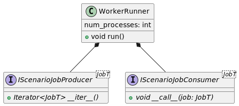
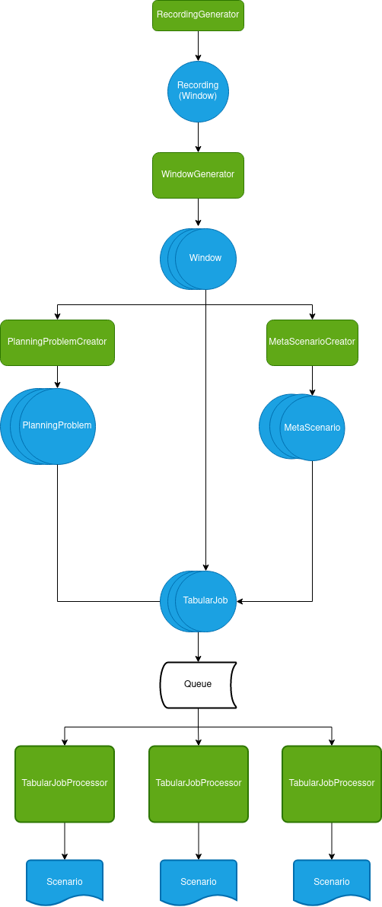

Architecture
=======================================================

Overview
^^^^^^^^^^^^^^^^^^^^^^^^^^^^^^^^^^^^^^^^^^^^^^^^^^^^^^^

Trajectory datasets suitable for conversion into the CommonRoad format come in many different formats. Therefore high
flexibility for the conversion framework is required. We tackle this problem by a hierarchical approach, allowing customization
and adaption on each layer. On the highest level, a simple single producer-multi consumer scheme is introduced to split work in
independent jobs (usually creating one scenario), which can be run in parallel.

A runner object drives the processing and takes care of the (optional) multi-processing.

.. autoclass:: commonroad_dataset_converter.conversion.util.runner.WorkerRunner
   :members:
   :undoc-members:
   :member-order: bysource

Factory
^^^^^^^^^^^^^^^^^^^^^^^^^^^^^^^^^^^^^^^^^^^^^^^^^^^^^^^

To separate object creation logic from processing logic, the factory pattern is used. For each dataset, a factory builds
the runner object considering the parameters for the conversion. Factories can be reused by splitting up the tasks of
building the produced and consumer into more fine grained tasks and overriding methods, as done in :py:class:`~commonroad_dataset_converter.conversion.tabular.factory.TabularConverterFactory`

Tabular API
^^^^^^^^^^^^^^^^^^^^^^^^^^^^^^^^^^^^^^^^^^^^^^^^^^^^^^^

.. py:module:: commonroad_dataset_converter.conversion.tabular
   :noindex:

Since many trajectory datasets come in form of tabular data or can be easily brought into a tabular form, we create an
API specifically designed to make conversion of these datasets as simple as possible. The main idea is to bring the dataset
into a form only consisting of

1. A table of dynamic obstacle states,
2. a table of static information about obstacles (e.g. obstacle shape and type),
3. a static scene environment represented as a scenario without any dynamic obstacle.

To convert a new tabular dataset, only an iterator providing time windows of the dynamic obstacle information (1. and 2.)
and a meta scenario creator has to be implemented. Practically speaking, this is fulfilled by implementing the corresponding
interfaces :py:class:`~interface.IRecordingGenerator` and :py:class:`~interface.IMetaScenarioCreator`

.. code-block:: python

    @dataclass
    class MyRecordingMeta:
        # Store meta data e.g. to select corresponding map to recording.
        recording_meta: Dict[str, Any]

    @dataclass
    class MyMetaScenarioCreator(IMetaScenarioCreator[MyRecordingMeta]):
        map_dir: Path
        ...

        def __call__(self, window: Window, window_meta: MyRecordingMeta) -> Scenario:
            # Read map from file or cache
            return self.open_map(self.map_dir)

    @dataclass
    class MyRecordingGenerator(IRecordingGenerator[MyRecordingMeta]):
        data_path: Path
        ...

        def __iter__(self) -> Iterable[Tuple[Window, MyRecordingMeta]]:
                # Read dynamic obstacle data from files
                yield Window(
                    vehicle_tracks[["x", "y", "velocity", "orientation", "acceleration"]],
                    tracks_meta[["width", "length", "obstacle_type"]],
                    dt
                ), MyRecordingMeta(recording_meta_data)

The base classes are generic to allow passing a WindowMeta object. This object communicates to the MetaScenarioCreator,
which meta scenario is to be created.

Finally, building the converter is achieved by creating a corresponding factory inheriting from
:py:class:`~factory.TabularConverterFactory`, instantiating the previously created classes.

.. code-block:: python

    class MyConverterFactory(TabularConverterFactory, metaclass=ABCMeta):
        input_dir: Path
        ...

        def build_recording_generator(self) -> MyRecordingCreator:
            return MyRecordingGenerator(self.input_dir)

        def build_meta_scenario_creator(self) -> MyMetaScenarioGenerator:
            return MyMetaScenarioCreator(
                self.input_dir.parent / "DEU_Map-1.xml"
            )

